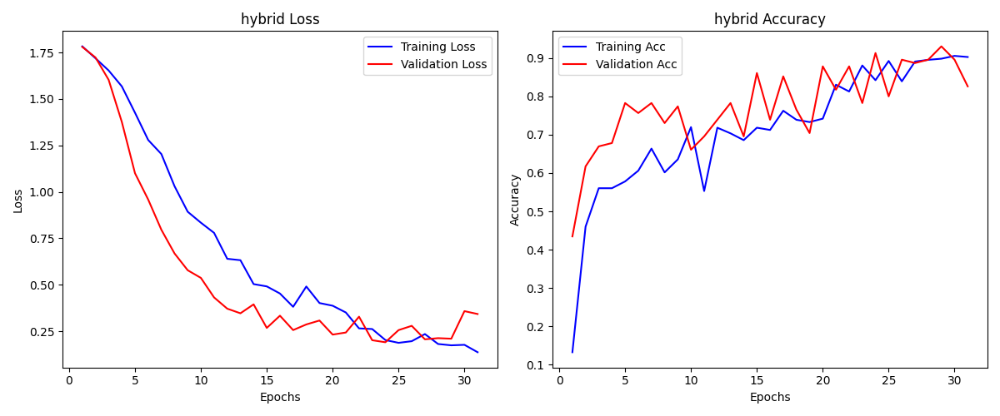
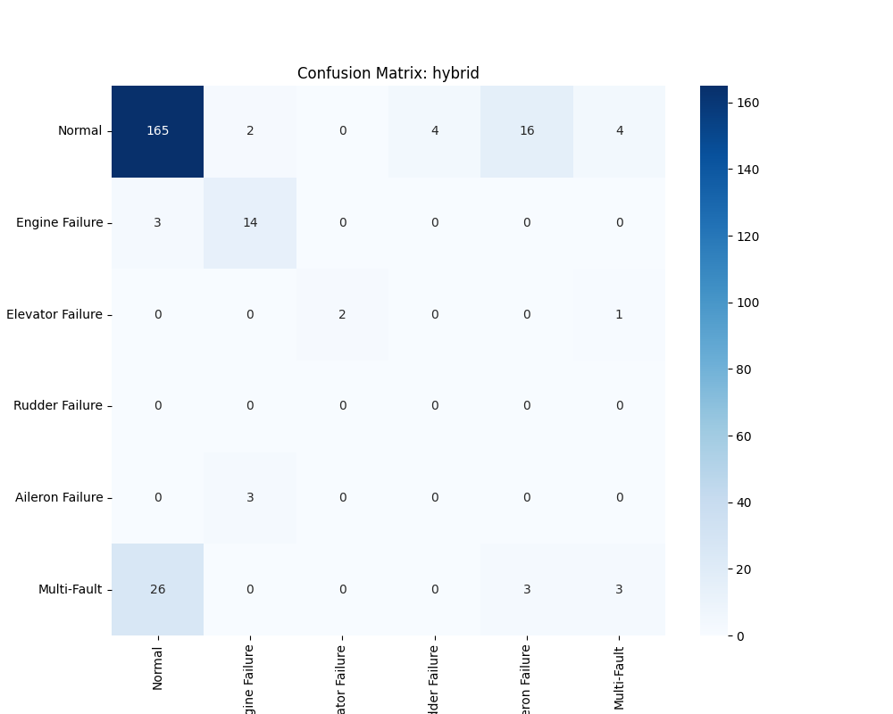

# PX4 AI Classifier

A Deep Learning-based MVP system that automatically detects and classifies mechanical failures by analyzing flight logs from fixed-wing UAVs.

## Project Architecture
This project focuses on identifying 6 different flight states (Normal + 5 Fault Types) using PyTorch, processing multi-sensor temporal data (IMU, GPS, Actuators).

The data pipeline and training logic are modularized:
*   `data/data_bulding/`: Scripts to aggregate and clean raw drone logs (e.g., `merge_asof`).
*   `data/preprossing/`: Correlation analysis, missing value patching, and Stratified Group splitting.
*   `src/`: PyTorch Deep Learning architecture.
    *   `config.py`: Centralized hyperparameters.
    *   `dataloader/`: PyTorch Dataset and rolling window logic.
    *   `models/`: CNN, LSTM, and Hybrid architectures.
    *   `train.py`: Local training engine.
    *   `train_modal.py`: Cloud training orchestration (Modal).
*   `training_results/`: Locally downloaded models, learning curves, and confusion matrices.

## Labeling Map
*   `0`: Normal / No Failure
*   `1`: Engine Failure
*   `2`: Elevator Failure
*   `3`: Rudder Failure
*   `4`: Aileron Failure
*   `5`: Multi-Fault

## How to Run the Project

### 1. Data Pipeline
To regenerate the Train/Val/Test splits from raw data:
```bash
uv run data/data_bulding/build_clean_dataset.py
uv run data/data_bulding/build_master_dataset.py
uv run data/preprossing/preprocess_and_split.py
```

### 2. Training on the Cloud (Modal)
We use [Modal](https://modal.com/) to train models on high-performance A10G GPUs. This command trains all architectures (CNN, LSTM, Hybrid) and automatically downloads the results.

```bash
uv run modal run src/train_modal.py --model all
```
*Note: Results are saved to a Modal Volume and then synced to your local `training_results/` folder.*

### 3. Evaluating Results
To compare the performance of all trained models locally on the test set:
```bash
uv run evaluate_all.py
```

## Final Model Comparison
After training and rigorous evaluation, the following results were achieved:

| Model | Accuracy | F1-Score | Status |
| :--- | :--- | :--- | :--- |
| **🏆 HYBRID** | **74.80%** | **0.7485** | **Recommended** |
| **CNN** | 73.98% | 0.7439 | Strong Baseline |
| **LSTM** | 52.85% | 0.6200 | Temporal Baseline |

The **Hybrid (CNN+LSTM)** model is the final choice, providing the best balance between detecting sharp sensor anomalies and understanding long-term flight trends.

## 🏆 Best Model: HYBRID - Performance Analysis

The Hybrid model achieved the highest performance by effectively capturing both high-frequency vibration patterns (via CNN layers) and long-term temporal dependencies (via LSTM layers).

### Training Logs (Learning Curves)

*The training logs show steady convergence. The model successfully learned complex patterns without significant overfitting.*

### Confusion Matrix

*The confusion matrix demonstrates strong classification performance across most failure modes.*

### Detailed Metrics: HYBRID
| Metric | Performance |
| :--- | :--- |
| **Test Accuracy** | 74.80% |
| **Test F1-Score** | 0.7485 |
| **Training Device** | NVIDIA A10G (Cloud) |
| **Architecture** | 1D-CNN + LSTM Hybrid |

## Running Tests
To verify that the dataset and dataloaders are functioning correctly:
```bash
uv run tests/test_pipeline.py
uv run src/dataloader/dataset.py
```
